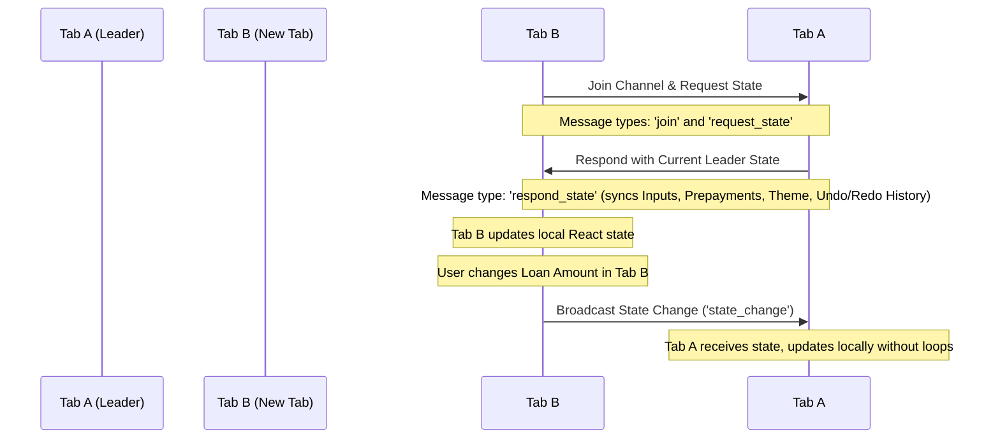

# Premium EMI Calculator & Prepayment Planner

A state-of-the-art, interactive, and responsive web application built with **Next.js**, **React 19**, **TypeScript**, **Tailwind CSS v4**, and **Ant Design**. The application calculates EMIs, maps amortization schedules, evaluates prepayment impact, and offers seamless real-time session synchronization across multiple browser tabs.

---

## 🌟 Key Features

1. **Dynamic EMI Calculation**: Instantly computes Monthly EMI, Total Interest Payable, and Total Amount Payable based on principal, interest rate, and tenure.
2. **Interactive Prepayment Planner**: Allows users to schedule prepayments for any month. Displays live metrics on **Interest Saved** and **Tenure Reduced** (months saved).
3. **Real-time Multi-Tab Sync**: Automatically broadcasts input values, scenarios, prepayments, and themes across all open browser tabs in real time.
4. **Shared Undo / Redo History**: Tracks up to 50 states for undo/redo actions (via header buttons or standard `Ctrl + Z` / `Ctrl + Y` keyboard shortcuts), synced instantly across all tabs.
5. **Sensitivity Analysis**: Maps monthly EMI variations against dynamic interest rates (vertical axis) and loan tenures (horizontal axis).
6. **Polished Premium UI/UX**:
   - Modern typography (`Inter` font) and clean spacing.
   - Smooth light/dark theme transition.
   - Custom equal-height alignments to avoid layout shifts.

---

## ⚡ The Broadcast API (`BroadcastChannel`)

This project implements a custom real-time state synchronization system across multiple tabs using the web browser's native **[BroadcastChannel API](https://developer.mozilla.org/en-US/docs/Web/API/BroadcastChannel)**.

### How It Works

All state management is centralized inside the custom hook `useSharedState.ts`. The tab lifecycle and synchronization sequence run as follows:



### Protocol & Message Types
The channel communicates via the following message protocols:
- `join`: Sent by a new tab upon initialization to announce its presence.
- `pong` / `heartbeat`: Sent periodically to maintain an active registry of open tabs. Older tabs resolve leadership status based on creation timestamps.
- `request_state`: Sent by newly opened tabs when no initial URL parameters are present to fetch state from the active leader tab.
- `respond_state`: Sent by the leader tab to feed the full state history to the requesting tab.
- `state_change` / `undo_redo`: Dispatched whenever a user modifies any input parameter, adds/removes prepayments, or triggers undo/redo, updating all other tabs instantly.

---

## 🚀 Getting Started

### Prerequisites
- Node.js (v18 or higher)
- npm or bun

### Setup & Run
1. Install dependencies:
   ```bash
   npm install
   ```
2. Start the development server:
   ```bash
   npm run dev
   ```
3. Open `http://localhost:3000` in multiple browser tabs side-by-side to witness the real-time `BroadcastChannel` synchronization in action!
4. Build for production:
   ```bash
   npm run build
   ```
